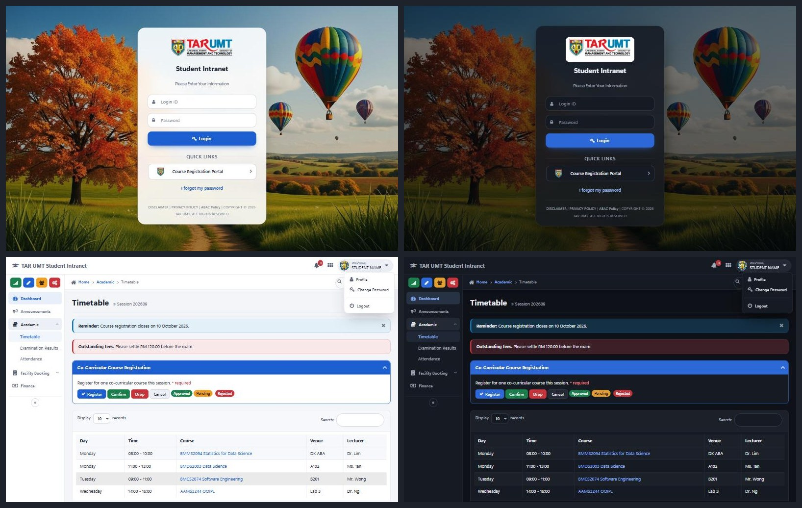

# TARUMT Intranet Beautifier

A Chrome extension that gives the TAR UMT [Student Intranet](https://web.tarc.edu.my/portal/login.jsp) and [Course Registration Portal](https://reg.tarc.edu.my/portal/) a modern, accessible look, with light and dark themes.



## Features

- **Light, dark or match your system**, switchable from the toolbar popup. Open tabs update instantly with no reload and no flash of the wrong theme.
- **Five accent colours**: blue, teal, violet, rose and green.
- **Redesigned login pages**: the logo, form and links sit in a single card over the school's seasonal photo. You can turn the photo off for a plain background.
- **A cleaner frame on every inner page**: top bar, sidebar menu, breadcrumbs, cards, tables, tabs, alerts and form controls.
- **Accessibility**: text colours meet WCAG AA contrast, every page gets a visible keyboard focus ring, it honours "reduce motion", there's an optional larger-text mode, and inputs that only had placeholders get screen-reader labels.
- **On/off switch**: turn the new look off to see the original site, for example if a page looks wrong.

## Install (unpacked)

1. Download or clone this folder.
2. Open `chrome://extensions` (or `edge://extensions`) and turn on **Developer mode**.
3. Click **Load unpacked** and choose this folder (the one containing `manifest.json`).
4. Pin the extension from the puzzle-piece menu, then click its icon to change the settings.

There is no build step. Edit a file, then click the reload arrow on the extension's card and refresh the intranet tab.

## How it works

| Path | What it does |
| --- | --- |
| `manifest.json` | Tells Chrome to inject the styles and `src/theme.js` into `web.tarc.edu.my` and `reg.tarc.edu.my`. |
| `src/settings.js` | Setting names and defaults, shared by the page script and the popup. |
| `src/theme.js` | Reads your settings and sets `data-tib-*` attributes on `<html>`. Every style is scoped to those attributes, so switching off restores the original site. |
| `src/styles/tokens.css` | All colours, radii and shadows for light, dark and each accent. Start here to change the palette. |
| `src/styles/base.css` | Type, links, focus rings, inputs, buttons, alerts, labels, menus. |
| `src/styles/login.css` | Login and forgot-password pages. |
| `src/styles/layout.css` | Top bar, sidebar, breadcrumbs, page title, footer. |
| `src/styles/components.css` | Cards, tables, tabs, panels, profile tables, plus dark-mode fixes for colours hard-coded in the site's HTML. |
| `popup/` | The settings popup. |

The intranet is built on the Ace admin template (Bootstrap 3). Ace marks many colours `!important`, so some rules here are `!important` too.

## Previewing without logging in

`dev/` holds saved copies of pages and a small preview setup:

```bash
node dev/make-previews.mjs
python dev/serve.py
```

Then open `http://localhost:8765/dev/preview/web-login.html?theme=dark`. Query options: `theme=system|light|dark`, `accent=blue|teal|violet|rose|green`, `text=large`, `bg=plain`, `off=1`.

To add a page, open it on the intranet, press **Ctrl+S**, choose **Webpage, HTML only**, and save it into `dev/pages/`. Pages saved after logging in contain your personal details, so `.gitignore` keeps them out of git. Only the public login pages and `mock-dashboard.html`, a stand-in built from the Ace template, are committed.

## Credits

Originally created by Chan Alston ([AlstonChan/TARUMT-Intranet-Beautifier](https://github.com/AlstonChan/TARUMT-Intranet-Beautifier)). Licensed under GPL-3.0-or-later; see `LICENSE.txt`.

This is an unofficial project and is not affiliated with TAR UMT.
